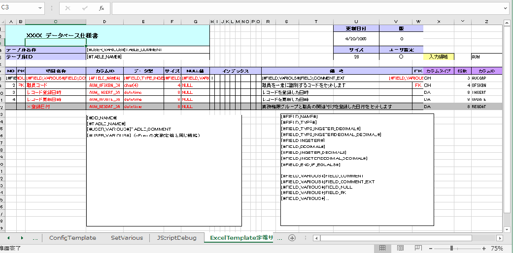

# ClassFromDB
Use of template, create Java Class or any other format files from DB or Excel files. ClassFromDB is a C# Windows Application. 
It is very useful when you use different data/records to fill template to create large amount of files. 
 
Here is the help file:<a href="help/ClsFromDB-readme.xls">ClsFromDB-readme.xls</a>

Here is sample captures. 
 
 
 
 
